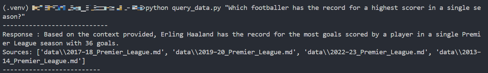
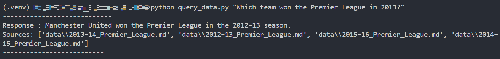

# PL-RAG
Simple RAG CLI app to demonstrate RAG functionalities on Premier League files from Wikipedia (2013-14 to 2023-24)

## Instructions
1.  `git clone https://github.com/Grogu22/PL-RAG.git`
2.  `cd PL-RAG`
3. Open up a virtual environment and activate it
4. Install requirements
   ```bash
   pip install -r requirements.txt
   ```
5. Create a file named `env.py`
   ```python
   openai_api_key = '<YOUR_OPENAI_API_KEY>
   ```
6. Create the DB
   ```python
    python create_db.py
   ```
7. Query DB
   ```python
   python query_data.py <YOUR_QUERY>
   ```
## Trial
Query = *Which footballer has the record for a highest scorer in a single season?*


Query = *Which team won the Premier League in 2013?*


## Acknowledgements
I got all the PL data in markdown by using [wikipedia-markdown-generator](https://github.com/erictherobot/wikipedia-markdown-generator).
